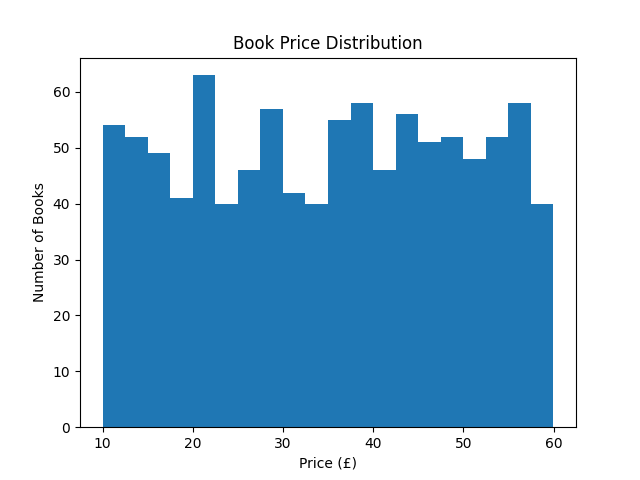
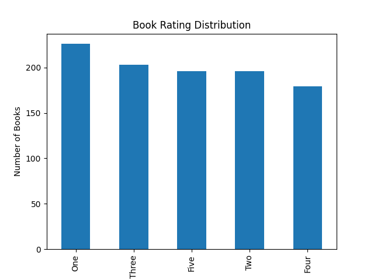

# Web Scraping & Data Analytics Project 

## Overview
This project demonstrates web scraping and basic data analytics using Python.
Data is scraped from http://books.toscrape.com, a practice website for scraping.

## Objectives
- Scrape product data using BeautifulSoup
- Store data in CSV format
- Clean and analyze the data using Pandas
- Perform basic exploratory data analysis

## Technologies Used
- Python
- Requests
- BeautifulSoup
- Pandas
- Matplotlib (optional)

## Data Visualizations

### Price Distribution

### Rating Distribution

## Files
- `books_scraper.py` – Scrapes book data
- `analyze.py` – Cleans and analyzes the data
- `books_data.csv` – Scraped dataset

## Machine Learning

### Price Prediction Model
- Built a Linear Regression model to predict book prices based on ratings
- Used train-test split and evaluated using MAE and R² score
- Demonstrates feature engineering and model evaluation

## Author
Stephania Clarice A S
